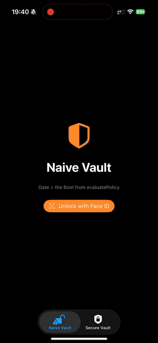
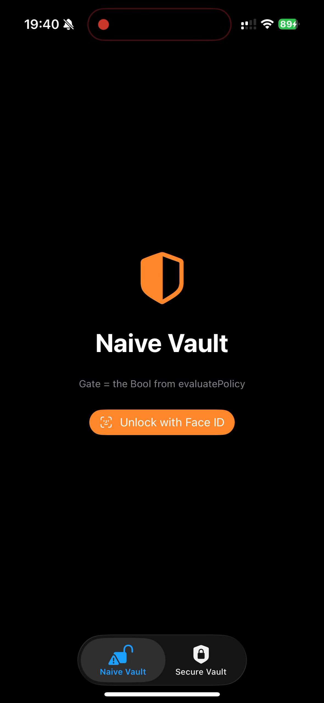
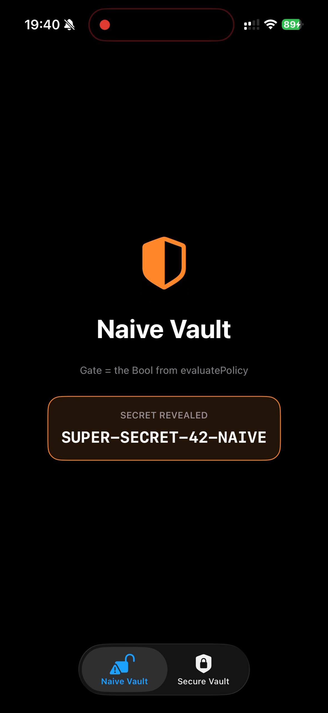
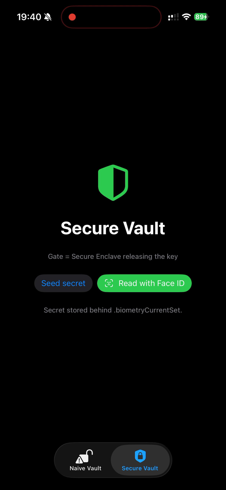
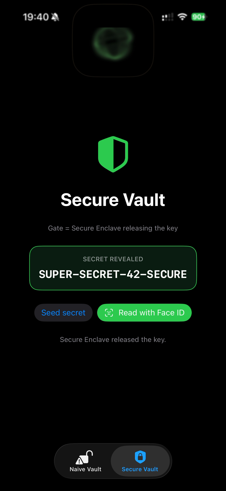
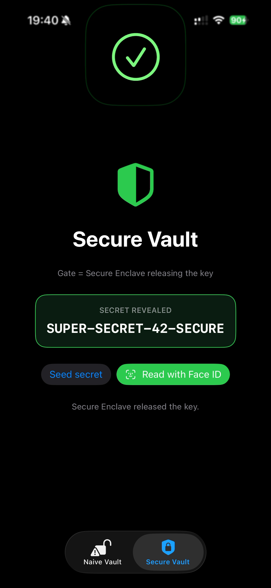

# The Face ID Bypass Everyone Copies From Stack Overflow (And Why It Doesn't Actually Work)

### I injected a dylib into an iOS app to fake a successful Face ID scan — no jailbreak required. It worked perfectly. And it also protected nothing. Here's the difference, all the way down to the Secure Enclave.

---

If you've spent any time reverse engineering iOS apps, you've seen this advice. It shows up on Stack Overflow, in Telegram groups, in every "how to bypass biometric auth" thread:

> "Just hook `-[LAContext evaluatePolicy:localizedReason:reply:]` and call the reply block with `YES`. Face ID bypassed."

It sounds too easy. And for a lot of apps… it genuinely works. You tap the button, the Face ID sheet never even appears, and you're in.

So I did what I always do when something looks too easy: I assumed I didn't understand it yet, and I built a lab to prove it to myself. This article is that experiment — a real iOS app with two "vaults," one dylib that fakes biometric success, and a jailbreak-free way to inject it using **Sideloadly**. Then we follow the faked `YES` all the way down to the one place where the trick completely falls apart: the Secure Enclave.

By the end you'll understand not just *how* to write the bypass, but *why* it's often useless — and that second part is the thing that actually makes you dangerous as a reverse engineer.

> **Disclaimer:** everything here targets an app I wrote myself, on my own device, purely to understand how the framework behaves. Don't point any of this at software you don't own.

---

## The lab: two vaults that look identical

I built a tiny SwiftUI app with two tabs. On the surface they do the same thing — "authenticate with Face ID, then reveal a secret." Under the hood they could not be more different.

**Naive Vault.** The secret is a string in memory. Face ID is used purely as a UI gate: if `evaluatePolicy` reports success, we show it.

```swift
let context = LAContext()
context.evaluatePolicy(
    .deviceOwnerAuthenticationWithBiometrics,
    localizedReason: "Unlock your naive vault"
) { success, error in
    if success {
        self.unlocked = true   // <-- the entire "security" is this Bool
    }
}
```

**Secure Vault.** The secret lives in the Keychain behind a biometric access control. The app never branches on a boolean — it just asks the Keychain for the bytes, and *the retrieval itself* triggers biometric evaluation:

```swift
let access = SecAccessControlCreateWithFlags(
    nil,
    kSecAttrAccessibleWhenPasscodeSetThisDeviceOnly,
    .biometryCurrentSet,     // require a live biometric match
    nil
)!
// ...store the secret under `access`...

// To read it later:
let context = LAContext()
let query: [String: Any] = [
    kSecClass: kSecClassGenericPassword,
    kSecAttrAccount: "vault_master_secret",
    kSecReturnData: true,
    kSecUseAuthenticationContext: context
]
var out: CFTypeRef?
let status = SecItemCopyMatching(query as CFDictionary, &out)
```

Same user-facing promise. One trusts a `Bool`. The other trusts hardware. Keep that distinction in mind — it's the whole article.

---

## The attack: one dylib, faked biometrics

Here's the classic bypass as an injectable dylib. A constructor runs on load and method-swizzles `LAContext` so the reply block is always called with success:

```objc
#import <objc/runtime.h>

typedef void (^LAReplyBlock)(BOOL success, NSError *error);

static void swizzled_evaluatePolicy(id self, SEL _cmd, NSInteger policy,
                                    NSString *reason, LAReplyBlock reply) {
    NSLog(@"[FaceIDBypass] evaluatePolicy intercepted --> forging reply(YES, nil)");
    if (reply) reply(YES, nil);   // never touch the real sensor
}

__attribute__((constructor))
static void FaceIDBypass_init(void) {
    Class LAContext = objc_getClass("LAContext");
    Method m = class_getInstanceMethod(LAContext,
                 @selector(evaluatePolicy:localizedReason:reply:));
    method_setImplementation(m, (IMP)swizzled_evaluatePolicy);
    NSLog(@"[FaceIDBypass] hooks installed. Naive vault is now wide open.");
}
```

That's it. When the app calls `evaluatePolicy`, my code answers instead of the biometric stack, and it always says yes.

---

## Getting it onto a non-jailbroken iPhone with Sideloadly

Here's the part people assume needs a jailbroken device. It doesn't. Because I have the app's IPA, I can let **Sideloadly** inject the dylib into the bundle and re-sign everything with a free Apple ID:

1. Build the dylib for a real device (`arch arm64`, `iphoneos` SDK).
2. Build an unsigned IPA of the app.
3. Drag the IPA into Sideloadly, enter your Apple ID.
4. **Advanced options → inject dylibs/frameworks →** add the dylib. Sideloadly copies it into `.app/Frameworks/`, adds the `LC_LOAD_DYLIB` command, and fixes the load path.
5. Install. Trust the developer profile in Settings → General → VPN & Device Management.

No jailbreak, no paid developer account (the free signature just expires after 7 days). This is the same tool I used to repackage an IPA in [my first reverse engineering article](https://medium.com/@bellaposa/ios-app-reverse-engineering-de33ab6ca462) — here it's doing the heavy lifting of injection and re-signing for us.

---

## Watching it work — and watching it fail

Here's the whole thing on a real, non-jailbroken iPhone with the dylib injected via Sideloadly:



### Naive Vault: opens with no face at all

I tap **Unlock with Face ID**… and the biometric sheet never appears. The secret is just *there*.




The forged `YES` walked straight through the app's `if success` branch. No sensor was ever consulted. Total win — this is the bypass everyone talks about, working exactly as advertised.

### Secure Vault: the forged boolean is ignored

Now the *same injected dylib* hits the Secure Vault. I tap **Seed secret**, then **Read with Face ID** — and iOS puts up a **real Face ID scan** that my hook can't skip. Only my actual face releases the secret; the log even says *"Secure Enclave released the key."*





Same hook, same process, two completely opposite outcomes. On the naive vault my fake `YES` was the key to the kingdom. On the secure vault it was worth nothing — the phone demanded a genuine biometric match before it would give up a single byte.

Why?

---

## Following the `YES`: it never lived in the app

So where does that boolean actually come from? Let's open the framework itself. You don't need to guess — the framework binary ships inside the iOS Simulator runtime, so you can analyze a real copy on your own Mac (`.../iOS 26.5.simruntime/.../LocalAuthentication.framework/LocalAuthentication`), no jailbreak and no leaked binaries.

First, dump `LAContext`'s Objective-C metadata. Even before opening a disassembler, `otool` gives away the whole game:

```
$ otool -oV LocalAuthentication | grep -iE "NSXPCConnection|LAContextXPC|remoteContext"
    attributes ... T@"NSObject<LAContextXPC>",&,N,V_remoteContext
    attributes ... T@"NSObject<LAContextXPC>",R,N,V_synchronousRemoteContext
    attributes ... T@"NSXPCConnection",R,N,V_connection
    attributes ... T@"NSXPCConnection",R,N,V_serverConnection
```

`LAContext` isn't a decision engine — it's a **thin XPC client**. Its instance variables are literally two `NSXPCConnection`s (`_connection`, `_serverConnection`) and a remote proxy (`_remoteContext`) typed against an `LAContextXPC` protocol.

Now disassemble the public entry point. `-[LAContext evaluatePolicy:localizedReason:reply:]` builds an options dictionary, mints a command id, and then just… forwards:

```
-[LAContext evaluatePolicy:localizedReason:reply:]:
    ...
    bl  _objc_msgSend$dictionaryWithObjects:forKeys:count:   ; package the options
    bl  _objc_msgSend$newCommandId                           ; tag the request
    ...
    bl  _objc_msgSend$_evaluatePolicy:options:log:cid:synchronous:reply:  ; hand it off
```

Follow that call and you get a clean forwarding chain that ends at an XPC round-trip — there is *no biometric logic in this process at all*:

```
-[LAContext evaluatePolicy:localizedReason:reply:]
  → _evaluatePolicy:options:log:cid:synchronous:reply:
  → _evaluatePolicy:options:synchronous:reply:
  → -[LAClient evaluatePolicy:options:uiDelegate:synchronous:reply:]
  → -[LAClient _performSynchronous:callId:finally:]
       → _recoverConnectionIfNeeded
       → setRemoteContext:
       → talks over NSXPCConnection to another process
```

In other words: **`evaluatePolicy` barely does anything locally.** It packages your policy and reason and ships them over XPC. Your `reply` block isn't invoked by your app's logic; it fires later, when a reply comes back across that connection.

The process on the other end is a daemon called **`coreauthd`** (Core Authentication), and behind it sits **`biometrickitd`**, which actually talks to the TrueDepth camera / Touch ID hardware. Your app never sees a face map or a fingerprint. It sends "please evaluate this policy" and waits for a verdict:

```
Your app ──(LAContext)──► coreauthd ──► biometrickitd ──► Secure Enclave / sensor
   ▲                                                              │
   └──────────── reply(success, error) ◄──── verdict ◄───────────┘
```

This already explains the Naive Vault. That boolean is generated *in my app's address space* when the reply block fires — so hooking the block means I'm forging the verdict *after* it crosses back into my process. Trivial to fake, because at that point it's just a local `Bool` again.

But it also hints at why the Secure Vault is immune: if the sensitive material never travels back as a plain boolean — if it's gated somewhere across that XPC boundary, in hardware I can't reach — then forging the boolean buys me nothing.

---

## Where the real lock lives: the Secure Enclave

The Secure Vault doesn't check a boolean to decide whether to show the secret. It asks the Keychain for an item that's protected by `.biometryCurrentSet`. That key is wrapped by a key that lives inside the **Secure Enclave (SEP)** — a separate processor with its own memory that the application processor (where my dylib runs) *cannot read into*.

To unwrap it, the SEP requires a **fresh, successful biometric match**, asserted by `biometrickitd` and the SEP itself — not by my Objective-C swizzle. My `reply(YES, nil)` never enters this path. `SecItemCopyMatching` doesn't ask `LAContext` for a boolean; it asks the SEP to release a key, and the SEP answers to hardware, not to my hook.

I can lie to the app all day. I cannot lie to the Secure Enclave.

That's the whole lesson in one sentence: **the boolean was theater; the key was the security.**

---

## An honest detour: the Simulator will fool you

Before I had this working on a real phone, I ran the same self-test on the iOS **Simulator** — and the Secure Vault appeared to hand over its secret without any match at all:

```
[SelfTest] SECURE VAULT: released on the SIMULATOR (status=0).
[SelfTest] NOTE: the Simulator has no Secure Enclave, so biometric
           access control is NOT enforced here.
```

That threw me for a minute, and it's worth calling out because it's a trap a lot of people fall into. **The Simulator has no Secure Enclave**, so it doesn't truly enforce biometric-gated Keychain items. If you "test" your bypass in the Simulator, you'll conclude the secure design is broken too — and you'll be wrong. The contrast only becomes real on physical hardware. Use the Simulator to prove the *naive* bypass works; use a device to prove the *secure* design holds.

---

## So when does the bypass actually work?

Now the two results make total sense. The bypass wins precisely when an app treats Face ID as a **UI gate** instead of a **cryptographic gate**:

- ✅ **Works:** app calls `evaluatePolicy`, and on `success == true` it flips `isUnlocked = true` or navigates to a screen. The secret was already in memory. The boolean was the only lock. (Sadly, this is *most* "app lock" tutorials.)
- ❌ **Doesn't work:** the secret is stored under a `.biometryCurrentSet` access control and fetched *through* the Keychain, so the Secure Enclave enforces the match. The boolean is decorative.

**If you're a defender:** never branch on the `Bool`. Use the biometric result to *release a key*, not to *unlock a screen*. Bind your secrets to the Secure Enclave with `SecAccessControl`, and hand the `LAContext` to the Keychain via `kSecUseAuthenticationContext` so enforcement happens in a place an on-device attacker can't touch.

**If you're an attacker:** the moment you see a `.biometry*` access control on a Keychain item, stop hooking `LAContext`. You're at the wrong layer. The interesting boundary isn't in the app anymore — it's XPC and silicon.

---

## Try it yourself

The whole lab — the two-vault SwiftUI app, the injectable dylib, a Frida version of the hook, the Sideloadly IPA scripts, and the headless self-test — is on GitHub: **[repo link]**. Clone it, inject the dylib into your own build with Sideloadly, and *feel* the difference between UI security and hardware-backed security. That contrast is the entire point.

---

## What I actually took away

I set out to bypass Face ID and ended up learning something more valuable than a bypass: **iOS security is layered so that the decisions that matter happen in places your code can't reach.** The public API hands your app a friendly little `Bool`, but the `Bool` isn't where the security is. The security is an XPC hop away in `coreauthd`, and one more hop away in silicon you can't debug.

Reverse engineering isn't about finding the one-line hack. It's about refusing to stop at the layer where the hack *appears* to work, and following the value until you hit the layer where it's actually enforced. In this case that layer had a name: the Secure Enclave.

If you're building something that protects real secrets — do the boring, correct thing. Bind them to the SEP. Don't trust a boolean you handed to yourself.

---

*I write about iOS reverse engineering regularly — previous pieces cover [method swizzling on a jailbroken device](https://medium.com/@bellaposa/ios-app-reverse-engineering-de33ab6ca462) and [modifying in-game coins with LLDB](https://medium.com/@bellaposa/exploring-lldb-modifying-in-game-coins-in-a-mobile-game-bf7c7ed44746). Questions, corrections, or "hey, how do I contact you" messages welcome in the comments. 👇*
